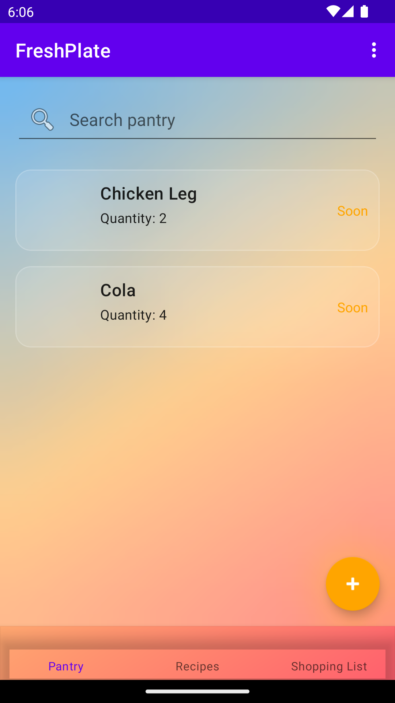
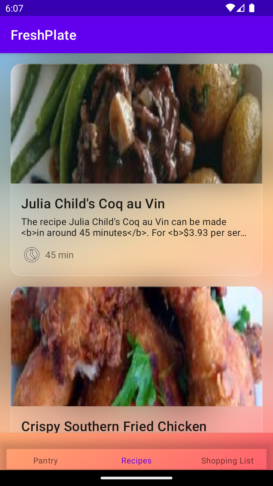
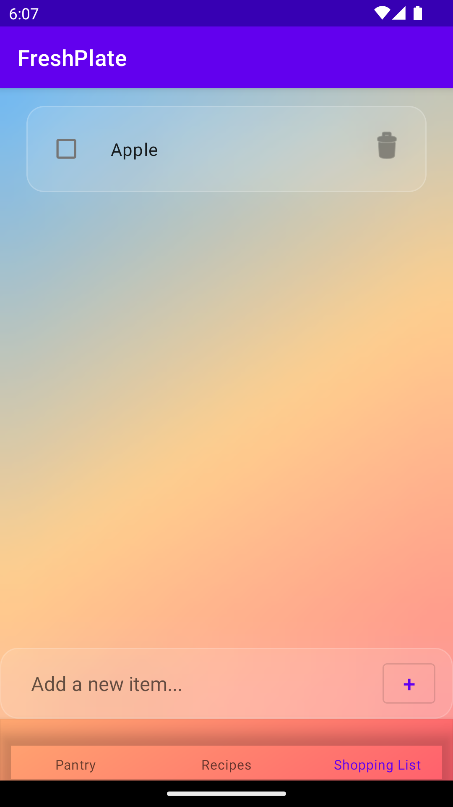
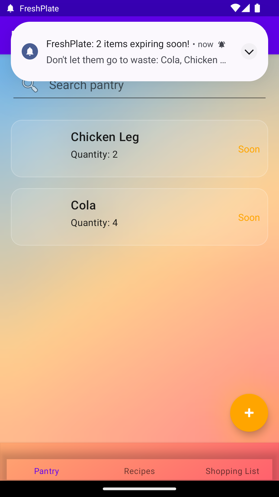

# 🍽️ FreshPlate

<div align="center">


**Smart Kitchen Management Made Simple**

[](https://www.android.com/)
[](https://android-arsenal.com/api?level=26)
[](https://github.com/yourusername/FreshPlate)
[](LICENSE)

*Your personal kitchen assistant for reducing food waste and discovering delicious recipes*

[Features](#-features) • [Download](#-download) • [Screenshots](#-screenshots) • [Tech Stack](#-tech-stack) • [Getting Started](#-getting-started)

</div>

---

## 📖 About

**FreshPlate** is an intelligent Android application designed to help you manage your kitchen pantry, track food expiration dates, discover recipes based on available ingredients, and maintain an organized shopping list. Say goodbye to food waste and hello to efficient meal planning!

### 🎯 Key Highlights

- 📦 **Smart Pantry Management** - Track all your food items with expiration dates
- 🔔 **Expiration Reminders** - Get notified before your food expires
- 📷 **Barcode Scanner** - Quickly add items by scanning product barcodes
- 🍳 **Recipe Discovery** - Find recipes based on what you have
- 🛒 **Shopping List** - Add ingredients directly from recipes
- 🎨 **Modern iOS-style UI** - Beautiful frosted glass design with liquid effects

---

## ✨ Features

### 🗄️ Pantry Management
- Add, edit, and delete pantry items
- Track quantities and expiration dates
- Visual indicators for item freshness (Fresh/Soon/Expired)
- Search and filter your pantry items
- Barcode scanning for quick item entry with automatic product name lookup via [OpenFoodFacts API](https://world.openfoodfacts.org/)

### ⏰ Smart Expiration Reminders
- Automatic daily background checks for items expiring within 3 days
- Push notifications with detailed expiration warnings
- One-tap testing feature for immediate expiration checks
- Battery-optimized background processing using WorkManager
- Android 13+ notification permission support

### 🍲 Recipe Integration
- Browse curated recipes from [Spoonacular API](https://spoonacular.com/)
- View detailed cooking instructions with step-by-step guidance
- See ingredient lists with quantities
- Add recipe ingredients to your shopping list with one tap
- Beautiful recipe images and categories

### 🛍️ Shopping List
- Maintain a persistent shopping list
- Add items manually or from recipes
- Mark items as purchased with satisfying animations
- Delete unwanted items with swipe gestures
- Clean, organized interface

### 🎨 Modern UI/UX
- iOS-inspired frosted glass (liquid glass) design
- Smooth animations and transitions
- Material Design 3 components
- Intuitive bottom navigation
- Responsive layouts for all screen sizes

---

## 📥 Download

### Latest Release
**Version 1.1** - [Download APK](app/release/FreshPlate.apk)

### System Requirements
- Android 8.0 (API 26) or higher
- ~20 MB storage space
- Internet connection for recipe browsing and barcode lookup

---

## 📱 Screenshots










---

## 🛠️ Tech Stack

### Architecture
- **Pattern**: MVVM (Model-View-ViewModel)
- **Language**: Java
- **Minimum SDK**: API 26 (Android 8.0)
- **Target SDK**: API 34 (Android 14)

### Key Libraries & Frameworks

#### Core Android
- **AndroidX** - Modern Android development components
- **Material Design 3** - Google's latest design system
- **Navigation Component** - Fragment navigation with SafeArgs
- **LiveData & ViewModel** - Lifecycle-aware data management
- **Data Binding** - Declarative UI binding

#### Database
- **Room** - SQLite abstraction layer for local data persistence
  - `PantryItem` - Food items with expiration tracking
  - `ShoppingItem` - Shopping list management
  - `Recipe` - Cached recipe data

#### Networking
- **Retrofit** - Type-safe HTTP client
- **Gson** - JSON serialization/deserialization
- **OkHttp** - HTTP client with interceptors

#### Background Processing
- **WorkManager** - Deferrable, reliable background work
  - Daily expiration checks
  - Battery-optimized scheduling

#### UI & Visuals
- **RecyclerView** - Efficient list rendering
- **BlurView** (Dimezis) - iOS-style frosted glass effects
- **Material Components** - Bottom sheets, dialogs, FABs

#### Barcode Scanning
- **ML Kit Barcode Scanning** - Google's ML-powered barcode scanner
- **CameraX** - Modern camera API

#### Utilities
- **Core Library Desugaring** - Java 8+ API support on older Android versions
- **ThreeTenABP** - Modern date/time API backport (java.time)

### External APIs
- **[Spoonacular API](https://spoonacular.com/food-api)** - Recipe data and images
- **[OpenFoodFacts API](https://world.openfoodfacts.org/data)** - Product information from barcodes

---

## 🚀 Getting Started

### For Users

1. **Download** the APK from the [releases section](app/release/FreshPlate.apk)
2. **Enable** installation from unknown sources in your Android settings
3. **Install** the APK on your device
4. **Grant** notification permissions for expiration reminders
5. **Start** managing your kitchen like a pro!

### For Developers

#### Prerequisites
- Android Studio Hedgehog (2023.1.1) or later
- JDK 11 or higher
- Android SDK 34
- Gradle 7.5+

#### Setup

1. **Clone the repository**
```bash
git clone https://github.com/yourusername/FreshPlate.git
cd FreshPlate
```

2. **Open in Android Studio**
   - Open Android Studio
   - Select "Open an existing project"
   - Navigate to the cloned directory

3. **Sync Gradle**
   - Android Studio will automatically sync Gradle dependencies
   - Wait for the build to complete

4. **Run the app**
   - Connect an Android device or start an emulator
   - Click the "Run" button or press `Shift + F10`

#### Build Configuration

```groovy
android {
    compileSdk 34
    
    defaultConfig {
        applicationId "com.example.freshplate"
        minSdk 26
        targetSdk 34
        versionCode 1
        versionName "1.1"
    }
}
```

---

## 📂 Project Structure

```
FreshPlate/
├── app/
│   ├── src/
│   │   └── main/
│   │       ├── java/com/example/freshplate/
│   │       │   ├── data/
│   │       │   │   ├── local/          # Room database, DAOs, entities
│   │       │   │   ├── remote/         # API services, models
│   │       │   │   └── repository/     # Data repositories
│   │       │   ├── ui/
│   │       │   │   ├── additem/        # Add pantry item screen
│   │       │   │   ├── pantry/         # Pantry list screen
│   │       │   │   ├── recipes/        # Recipe browsing & details
│   │       │   │   └── shopping/       # Shopping list screen
│   │       │   ├── util/               # Utility classes
│   │       │   ├── worker/             # Background workers
│   │       │   ├── MainActivity.java
│   │       │   └── FreshPlateApplication.java
│   │       └── res/
│   │           ├── layout/             # XML layouts
│   │           ├── drawable/           # Images & icons
│   │           ├── navigation/         # Navigation graphs
│   │           └── values/             # Strings, colors, themes
│   └── build.gradle
├── gradle/
├── build.gradle
└── settings.gradle
```

---

## 🔧 Configuration

### API Configuration

The app uses two external APIs:

1. **Spoonacular API**
   - Base URL: `https://spoonacular.com/food-api/`
   - Require API Key

2. **OpenFoodFacts API** (Open Database)
   - Base URL: `https://world.openfoodfacts.org/`
   - Requires User-Agent header (automatically added)

### Notification Configuration

Expiration reminders run daily. To modify the schedule, edit:

```java
// FreshPlateApplication.java
PeriodicWorkRequest workRequest = new PeriodicWorkRequest.Builder(
    ExpirationWorker.class,
    24, TimeUnit.HOURS // Change interval here
    // 1, TimeUnit.DAYS
).build();
```

---

## 🧪 Testing

### Manual Testing

The app includes a built-in testing feature for expiration reminders:

1. Open the **Pantry** screen
2. Tap the **menu icon** (⋮) in the top-right
3. Select **"Test Expiration Check"**
4. A notification will appear immediately if any items expire within 3 days

### Test Data

To test notifications, add pantry items with expiration dates 1-3 days from today.

---

## 🤝 Contributing

Contributions are welcome! Here's how you can help:

1. **Fork** the repository
2. **Create** a feature branch (`git checkout -b feature/AmazingFeature`)
3. **Commit** your changes (`git commit -m 'Add some AmazingFeature'`)
4. **Push** to the branch (`git push origin feature/AmazingFeature`)
5. **Open** a Pull Request

### Development Guidelines

- Follow standard Java code conventions
- Use meaningful variable and method names
- Add comments for complex logic
- Test your changes on multiple Android versions
- Update documentation as needed

---

## 🐛 Known Issues

- BlurView dependency requires JitPack repository (already configured)
- Some UI elements may need adjustment for tablets
- Recipe images require internet connection

---

## 📜 License

This project is licensed under the MIT License - see the [LICENSE](LICENSE) file for details.

---

## 👨‍💻 Author

**FreshPlate Team**

- GitHub: [@yebios](https://github.com/yebios)

---

## 🙏 Acknowledgments

- [Spoonacular API](https://spoonacular.com/) - Recipe API
- [OpenFoodFacts](https://world.openfoodfacts.org/) - Open food products database
- [Material Design](https://material.io/) - Design system and components
- [BlurView by Dimezis](https://github.com/Dimezis/BlurView) - Frosted glass effects
- All open-source contributors

---

## 📮 Contact & Support

Have questions or suggestions? Feel free to:

- **Open an issue** on GitHub
- **Star** this repo if you find it helpful!

---

<div align="center">

**Made with ❤️ for reducing food waste**

⭐ Star this repo if you find it useful!

</div>

